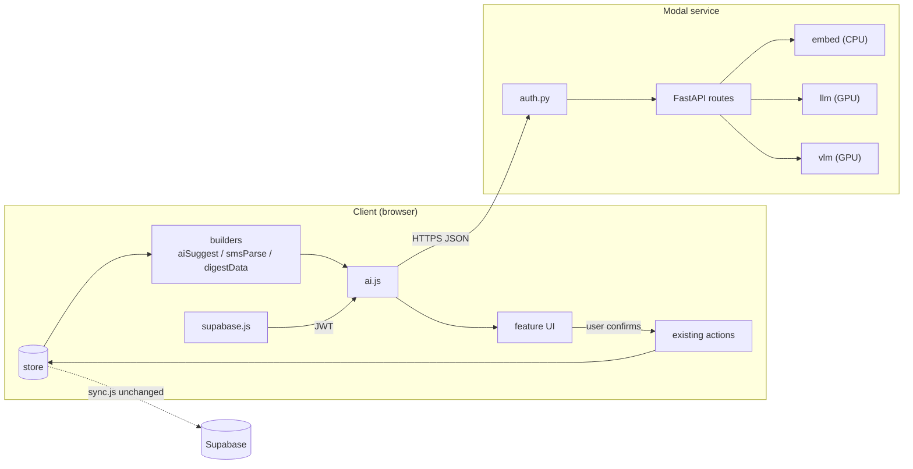

# Component Dependencies — AI Features (Cycle 2)

## Dependency matrix (row depends on column)

| ↓ depends on → | supabase.js | store (read) | actions | openers | ai.js | useAI | aiSuggest | smsParse | digestData | selectors | prefs |
| --- | --- | --- | --- | --- | --- | --- | --- | --- | --- | --- | --- |
| C1 modal/ service | JWT verify only¹ | — | — | — | — | — | — | — | — | — | — |
| C2 ai.js | ✅ (token) | — | — | — | — | — | — | — | — | — | — |
| C3 useAI | — | — | — | — | ✅ | — | — | — | — | — | ✅ (aiEnabled) |
| C4 aiSuggest | — | ✅ | — | — | — | — | — | — | — | — | ✅ (accept counters) |
| C5 smsParse | — | ✅ (accounts/cards) | — | — | — | — | — | — | — | — | — |
| C6 digestData | — | ✅ | — | — | — | — | — | — | — | ✅ | — |
| C7 UI surfaces | — | ✅ | ✅² | ✅ | — | ✅ | ✅ | ✅ | ✅ | — | — |

¹ verifies tokens ISSUED BY Supabase; never calls Supabase at request time (plan Q5=A).
² only `setTransactionsCategory` and `upsertPayee` — the complete list of AI-adjacent writes.

## Hard rules
- **Nothing depends on the AI layer**: store/, sync.js, actions.js, validate.js,
  existing screens compile and behave identically with every AI file deleted.
- **ai.js is the only network path** to the service; components never fetch.
- **No new synced collections**: prefs additions (aiEnabled, accept counters)
  ride the existing per-user prefs storage, not the ledger.
- **modal/ imports nothing from src/** (and vice versa); the JSON contract in
  component-methods is the only coupling, exercised by contract tests on both
  sides (mock fixtures shared via `modal/fixtures/*.json` used by pytest AND vitest).

## Data flow (text alternative first — content-validation rule)

Client store (read-only) → context/payload builders (C4/C5/C6, pure) →
ai.js (token from supabase.js) → HTTPS → Modal FastAPI (auth.py verifies) →
CPU embed / GPU llm / GPU vlm → JSON response → validation/mapping (C4/C5) →
UI render → user confirms → EXISTING actions write → store → sync.js → Supabase.

## Failure isolation
Every edge from `ai.js` outward is optional: severed edges (service down, toggle
off, no endpoint) leave the left-hand side a fully working app — the acceptance
bar for US-1/US-3 and the rollback story in the execution plan.
