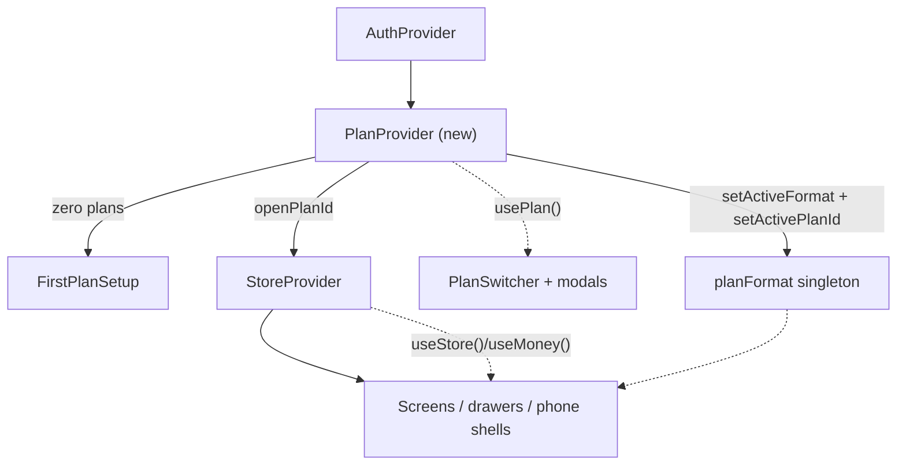
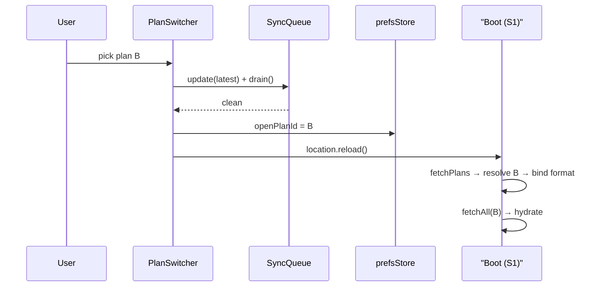

# Component Dependencies — Multi-Plan System

## Dependency matrix

| Component | Depends on | Consumed by |
|---|---|---|
| C1 plans schema | — (blocks all) | C2, C3 (tables/FKs), Supabase RLS |
| C2 PlanProvider | C3 (`fetchPlans`), prefsStore, AuthProvider | C6, StoreProvider (open plan id), first-use flow |
| C3 sync layer | C1 (columns), supabase client | StoreProvider (`fetchAll`), queue consumers |
| C4 format engine | plan settings shape (C1/C2) | calc.js/format.js/dates.js wrappers → every screen |
| C5 plan actions | store shape (plans collection via C3) | C6, S1 seeding |
| C6 shell UI | C2, C4 (previews), C5, Base UI primitives | Sidebar/Header, phone shell |

## Provider tree (communication pattern)

*Text alternative*: AuthProvider wraps PlanProvider (new), which either renders FirstPlanSetup (zero plans) or passes `openPlanId` down to StoreProvider, which serves the app. PlanProvider binds the format singleton and active plan id before hydration. The switcher and modals read PlanProvider; all data UI reads StoreProvider.

## Data flow — plan switch

*Text alternative*: switch = flush queue to clean, persist target id, reload; boot re-resolves the plan, binds formatting, and hydrates only that plan's rows.

## Coupling rules
- Screens/drawers never read `plan_id` — scoping is invisible below the store (store shape unchanged).
- Only `sync.js` knows about `plan_id` columns; only `PlanProvider` knows about persistence of the open plan.
- Formatting consumers never import `planFormat` directly — they keep using `useMoney()`/calc wrappers (prevents drift and keeps the mask composition in one place).
- Security boundary stays server-side (RLS + composite FK); every client-side filter/stamp is convenience.
