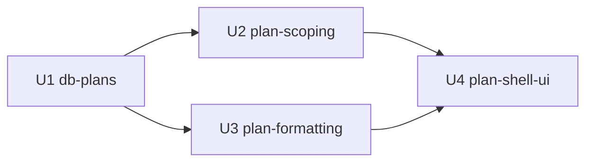

# Unit Dependencies — Multi-Plan System

## Dependency matrix

| Unit | Depends on | Provides to | Coordination contract |
|---|---|---|---|
| U1 db-plans | — | U2 (tables/FKs), U3 (settings columns/keys), U4 (via U2/U3) | settings column names + CHECK'd value keys are THE shared vocabulary (`currency`, `currency_placement`, `number_format`, `date_format`) |
| U2 plan-scoping | U1 | U4 (`usePlan()`, `switchPlan`, actions), U3 (open plan settings at boot) | `usePlan()` context shape; `fetchAll(planId)`; seed-flag handshake |
| U3 plan-formatting | U1 (settings keys), U2 (boot binding point) | U4 (previews via `makeFormatter`), every screen (via wrappers) | option catalogue keys must equal U1 CHECK values exactly |
| U4 plan-shell-ui | U1–U3 | end users | consumes only public interfaces (`usePlan`, `useStore`, `makeFormatter`) |

*Text alternative*: U1 feeds U2 and U3; U2 and U3 both feed U4. Build order U1 → U2 → U3 → U4.

## Cross-unit invariants
1. **Format keys**: `planFormatOptions` keys (U3) = CHECK constraint values (U1) = stored plan settings (U2 mappers). Single source documented in U1's functional design; U3 imports the same key list into tests.
2. **Plan id stamping**: only U2's sync layer writes `plan_id`; U4 never passes it.
3. **Defaults**: U1 backfill defaults = U3 "renders identical to today" defaults = U4 modal defaults (PKR / none / `123,456.78` / dd/mm/yyyy keys).
4. **Reload boundary**: U2's switch guarantees U3's singleton and U4's UI never see two plans in one app lifetime.

## Testing checkpoints
- After U1: migration + constraint tests on a DB copy
- After U2: sync contract tests (scoped fetch, stamped writes, plans round-trip), resolveOpenPlan unit tests
- After U3: PBT suites + existing formatting tests still green (defaults equivalence)
- After U4 (Build & Test): integrated Playwright pass across two plans, desktop + phone
