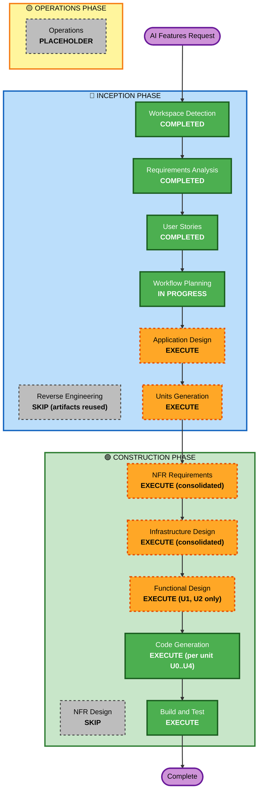

# Execution Plan — AI Features (Cycle 2)

## Detailed Analysis Summary

### Transformation Scope
- **Transformation Type**: Architectural addition — first component outside the
  client + Supabase pair (a Modal.com Python service), plus a client AI layer.
- **Primary Changes**: New `modal/` service package (FastAPI, self-hosted
  models, JWT verification); new `src/lib/ai.js` client module; feature UI in
  transactions (chips, paste, scan), user menu (toggle), Reflect (digest).
- **Related Components**: needs-category surfaces (TxChips, TxPhoneList,
  Transactions, Dashboard), payees machinery, drawer openers/TxSheet seed path,
  report selectors, prefs storage, `.env` config.

### Change Impact Assessment
- **User-facing changes**: Yes — four opt-in features; zero change with the
  toggle off (default).
- **Structural changes**: Yes — new deployable service; loose coupling via
  env-configured endpoint (client feature-detects).
- **Data model changes**: **No** — no Supabase schema change, no migration, no
  new synced collections. (Biggest de-risker vs cycle 1.)
- **API changes**: New external API (4 AI routes + health), versioned by the
  client module only.
- **NFR impact**: Yes — security (JWT, CORS, secrets), privacy (stateless,
  self-hosted), cost (scale-to-zero), latency (cold starts).

### Component Relationships
- **Primary**: `modal/` service (new) ← `src/lib/ai.js` (new, sole caller)
- **Consumers of ai.js**: U1 suggestion UI, U2 SMS flow (LLM tier only),
  U3 receipt flow, U4 digest UI
- **Untouched core**: store actions/sync/reducers — all AI writes go through
  EXISTING actions (`setTransactionsCategory`, `upsertPayee`, editor seeds)
- **Supporting**: UserMenu (toggle), `.env.example`, deploy docs

### Risk Assessment
- **Risk Level**: Medium — new runtime/language and external service, but: no
  schema/data migration, default-OFF toggle, suggest-only writes through
  existing audited actions.
- **Rollback Complexity**: Easy — toggle off (user), unset endpoint env
  (build), or `modal app stop` (operator); ledger untouched.
- **Testing Complexity**: Moderate — unit + mock cover 14/18 stories; 4 need a
  live-endpoint smoke runsheet.

## Workflow Visualization

## Phases to Execute

### 🔵 INCEPTION PHASE
- [x] Workspace Detection (COMPLETED)
- [x] Reverse Engineering (SKIPPED — cycle-1 artifacts reused + fresh integration survey)
- [x] Requirements Analysis (COMPLETED — approved 2026-08-24T17:20:00Z)
- [x] User Stories (COMPLETED — 18 stories approved 2026-08-24T17:42:00Z)
- [x] Workflow Planning (THIS DOCUMENT)
- [ ] Application Design — **EXECUTE**
  - **Rationale**: Two brand-new components (Modal service, client AI layer) need boundaries, request/response contracts per route, and dependency rules (ai.js as sole fetch point; writes only through existing actions).
- [ ] Units Generation — **EXECUTE**
  - **Rationale**: Five units anticipated (U0–U4) with a dependency order; formal decomposition + story mapping drives the per-unit loop.

### 🟢 CONSTRUCTION PHASE (per-unit where marked)
- [ ] Functional Design — **EXECUTE for U1 and U2 only**
  - **Rationale**: U1 (suggestion context assembly, confidence floor, acceptance counting → payee-rule graduation) and U2 (bank SMS pattern library, two-tier parse, last4 resolution) carry real business logic. U0 is plumbing pinned by FR-0 + Application Design; U3 composes U1+U2 patterns; U4 is a thin aggregate-assembly over existing selectors — all three pinned by their stories.
- [ ] NFR Requirements — **EXECUTE once (consolidated)**
  - **Rationale**: Tech stack selection for the new service (Python/FastAPI/model choices/pytest) + concrete cost/latency budgets; one consolidated pass like cycle 1.
- [ ] NFR Design — **SKIP**
  - **Rationale**: The only NFR patterns (JWT verify, timeouts, CORS, scale-to-zero) are simple and fully specified in NFR Requirements + Infrastructure Design; no novel patterns to design.
- [ ] Infrastructure Design — **EXECUTE once (consolidated)**
  - **Rationale**: Unlike cycle 1, this cycle genuinely adds infrastructure: Modal app topology (functions, GPU classes, scaledown), secrets management, deploy workflow, CORS/origins, endpoint env wiring. One consolidated doc.
- [ ] Code Generation — **EXECUTE ×5** (ALWAYS; per unit U0→U1→U2→U3→U4)
- [ ] Build and Test — **EXECUTE** (ALWAYS; includes live-endpoint smoke runsheet for US-4/11/13/15)

### 🟡 OPERATIONS PHASE
- [ ] Operations — PLACEHOLDER (deploy handoff runsheet: `modal deploy`, set VITE_AI_ENDPOINT, enable toggle)

## Unit Sequence & Dependencies
1. **U0 ai-foundation** — Modal app skeleton + auth + `/health`; client ai.js + toggle + warming/degradation states. *Blocks everything.*
2. **U1 auto-categorize** — `/categorize` + chips/accept/graduation. *Needs U0.*
3. **U2 sms-parse** — pattern library (client) + `/parse-sms` + paste flow. *Needs U0; independent of U1.*
4. **U3 receipt-scan** — `/parse-receipt` (VLM) + scan flow. *Needs U0; reuses U1's suggestion contract + U2's editor-seed path.*
5. **U4 insights-digest** — `/digest` + Reflect Overview UI. *Needs U0 only.*

Each unit merges independently behind the default-OFF toggle (Q1=A).

## Estimated Timeline
- **Total stages**: 11 remaining (2 inception + 9 construction incl. 5 codegen)
- **Estimated duration**: U0 is the largest (service + client foundation); U1–U4 are focused increments. Sized for session-based delivery with approval gates between all stages.

## Success Criteria
- **Primary Goal**: Four working AI features behind an opt-in toggle, spending pennies at personal volume, with the ledger's trust model intact (AI suggests, human confirms).
- **Key Deliverables**: `modal/` service (deployable via `modal deploy`), client AI layer + feature UI, tests (vitest + fast-check + pytest), live smoke runsheet, deploy handoff doc.
- **Quality Gates**: All 18 stories' acceptance criteria met per their verify mode; full existing suite stays green; build green; Security Baseline compliance at each stage.
