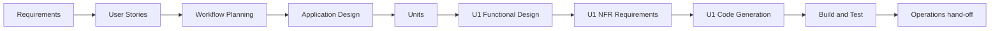

# Workflow Planning / Execution Plan — Command Palette (Cycle 3)

**Change type**: New user-facing UI feature, client-only, single cohesive module. Brownfield, one workspace (React SPA). No backend, no schema, no infra.

## Stages to Execute
| Stage | Decision | Depth | Rationale |
|---|---|---|---|
| Workspace Detection | ✅ done | — | Brownfield; RE reused |
| Reverse Engineering | ⏭ skip | — | Existing artifacts reused (UI-layer feature) |
| Requirements Analysis | ✅ done | Standard | requirements-command-palette.md |
| User Stories | ✅ done | Standard | 10 stories, 3 personas |
| Workflow Planning | ✅ this doc | — | — |
| Application Design | ✅ execute | Minimal | New module + components + UIProvider methods |
| Units Generation | ✅ execute | Minimal | Single unit (no decomposition) |
| **Construction — U1 command-palette** | | | |
| · Functional Design | ✅ execute | Standard | Pure match/rank + index model + PBT properties (PBT-01) |
| · NFR Requirements | ✅ execute | Minimal | Perf budget + PBT framework (fast-check already present) |
| · NFR Design | ⏭ skip | — | No new NFR patterns beyond memoization (covered in FD) |
| · Infrastructure Design | ⏭ skip | — | No infra/deploy change |
| · Code Generation | ✅ execute | — | The feature + tests |
| Build and Test | ✅ execute | — | vitest + build; a11y/keyboard live check |
| Operations | ✅ hand-off | — | PR + auto-deploy on merge (per raqam-deployment) |

## Sequence (text)
Requirements → Stories → Workflow Planning → Application Design → Units → [U1: Functional Design → NFR Requirements → Code Generation] → Build & Test → Operations.

## Autonomous-mode note
User directive 2026-08-30: "consider it a /goal, don't ask questions, proceed with recommended answers, end to end." All per-stage approval gates are auto-accepted with the AI's recommended answers and logged in audit.md; the deliverable is working, tested code on branch `worktree-command-palette`.
