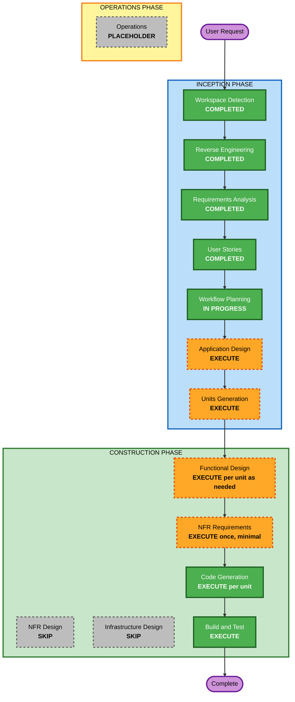

# Execution Plan — Multi-Plan System

## Detailed Analysis Summary

### Transformation Scope (Brownfield)
- **Transformation Type**: Architectural data-scoping change within a single package (SPA + Supabase schema) — no deployment-model or infrastructure change
- **Primary Changes**: New `plans` entity + `plan_id` scoping across all 13 per-user tables; plan-filtered fetch in the sync layer; plan-settings-driven formatting replacing hardcoded PKR/en-PK; new shell UI (switcher, New Plan modal, Open Plan, rename/delete)
- **Related Components**: `supabase/migrations/` (new migration), `src/store/sync.js` + store, `src/lib/calc.js`/`format.js`/`amountInput.js`/`dates.js` (formatting), app shell `src/components/Header.jsx`/Sidebar + phone shells, drawers/first-use flow, tests

### Change Impact Assessment
- **User-facing changes**: Yes — always-visible switcher, new modal flows, app-wide date/number rendering driven by plan settings (defaults preserve today's rendering)
- **Structural changes**: Yes — a new scoping dimension through schema → sync → store → UI
- **Data model changes**: Yes — `plans` table; `plan_id` NOT NULL + composite FK `(user_id, plan_id) → plans(user_id, id)` on 13 tables; backfill migration
- **API changes**: No new endpoints — Supabase PostgREST usage gains `plan_id` filters only
- **NFR impact**: Yes — security (ownership integrity, validated settings, fail-closed delete), performance (per-plan fetch), testing (PBT partial on formatting round-trips)

### Component Relationships
- **Primary**: Supabase schema → `src/store/sync.js` (13 collection descriptors) → in-memory store → screens/UI
- **Shared**: `src/lib/calc.js` + `format.js` (every screen renders through them); `src/lib/prefsStore.js` (open-plan persistence)
- **Dependent**: envelope/RTA math, reports, undo, audit views, payee sweeps, recurring — all consume the store and formatting, so they inherit scoping without individual redesign
- **Supporting**: vitest + fast-check tests; Playwright live verification; existing CI deploy unchanged

### Risk Assessment
- **Risk Level**: High — a data migration touches every row of a live personal ledger; scoping bugs could silently mix plans
- **Rollback Complexity**: Moderate — feature branch + single reversible migration file; production applies only after PR review; DB backup before applying
- **Testing Complexity**: Complex — migration equivalence, isolation invariants, format matrix (8 number × 3 placement × 7 date), two personas' first-run flows

## Workflow Visualization

*Text alternative*: Completed — Workspace Detection, Reverse Engineering, Requirements Analysis, User Stories; in progress — Workflow Planning. To execute — Application Design, Units Generation, then per-unit Functional Design (where logic warrants) + one minimal NFR Requirements pass + Code Generation, closing with Build and Test. Skipped — NFR Design, Infrastructure Design. Operations remains a placeholder.

## Phases to Execute

### 🔵 INCEPTION PHASE
- [x] Workspace Detection (COMPLETED)
- [x] Reverse Engineering (COMPLETED)
- [x] Requirements Analysis (COMPLETED)
- [x] User Stories (COMPLETED — 17 stories, 2 personas)
- [x] Execution Plan (IN PROGRESS — this document)
- [ ] Application Design — **EXECUTE**
  - **Rationale**: New components with real interface decisions: plan store slice + switch orchestration (flush → teardown → refetch), the formatting engine that replaces calc.js hardcoding, and shell components (switcher/modal) on Base UI primitives. Defining boundaries now keeps units independent.
- [ ] Units Generation — **EXECUTE**
  - **Rationale**: System-wide change decomposes naturally into 4 sequential units (below); new data models + state management changes meet the execute criteria.

### 🟢 CONSTRUCTION PHASE (per-unit loop)
- [ ] Functional Design — **EXECUTE for U1–U3, SKIP for U4**
  - **Rationale**: U1 (migration correctness), U2 (scoping/switch semantics), U3 (format engine + PBT-01 property identification) carry real business logic. U4 is composition of designed pieces into UI — its behavior is already pinned by stories US-4..US-10, US-16..17.
- [ ] NFR Requirements — **EXECUTE once (minimal, consolidated)**
  - **Rationale**: Tech stack is fixed; a single minimal pass documents the fast-check framework selection (PBT-09) and confirms NFR coverage from requirements.md. No per-unit repetition.
- [ ] NFR Design — **SKIP**
  - **Rationale**: No new NFR patterns — security is realized through U1's schema design (composite FK + RLS, already specified); no caching/scaling/observability additions.
- [ ] Infrastructure Design — **SKIP**
  - **Rationale**: Zero infrastructure change — same Supabase project, same Cloudflare Pages deploy, migrations follow the existing `supabase/migrations/` flow.
- [ ] Code Generation — **EXECUTE (always, per unit)**
  - **Rationale**: Implementation with Part 1 planning + Part 2 generation per unit.
- [ ] Build and Test — **EXECUTE (always)**
  - **Rationale**: vitest + fast-check suites, pnpm build, Playwright live verification of the 17 stories' ACs.

### 🟡 OPERATIONS PHASE
- [ ] Operations — PLACEHOLDER

## Unit Sequence (brownfield module coordination)

Single package — units are sequential slices of one codebase, each fully built before the next:

1. **U1 `db-plans`** — `plans` table, `plan_id` columns + backfill + composite FKs, RLS, settings CHECK constraints (blocks everything else)
2. **U2 `plan-scoping`** — sync.js plan filters + plan collection, store teardown/refetch switch flow, open-plan persistence + fallback, undo/audit scoping
3. **U3 `plan-formatting`** — format engine (currency/placement/number/date), option catalogs, amount-input parsing; PBT round-trips (depends on U1 settings shape; independent of U2 internals)
4. **U4 `plan-shell-ui`** — desktop switcher + phone entry, New Plan modal (Base UI), Open Plan list, rename/delete management, first-use integration (consumes U1–U3)

- **Update Approach**: Sequential
- **Critical Path**: U1 → U2 → U4 (U3 can interleave after U1)
- **Coordination Points**: plans settings shape (U1↔U3), store switch API (U2↔U4)
- **Testing Checkpoints**: per-unit vitest green; integrated Playwright pass in Build & Test

## Estimated Timeline
- **Total remaining stages**: Application Design → Units Generation → per-unit loop (4 units) → Build and Test
- **Estimated Duration**: 2–4 working sessions (U1+U2 are the heavy units; U3/U4 are broad but mechanical)

## Success Criteria
- **Primary Goal**: Multiple isolated plans with YNAB-parity creation/switching, existing data untouched in "My Plan"
- **Key Deliverables**: migration SQL, plan-scoped sync/store, format engine, shell UI (desktop + phone), test suites
- **Quality Gates**: per-stage user approvals; security compliance (no blocking findings); PBT-02/03/07/08/09 satisfied; migration equivalence verified; Playwright story-AC pass
- **Integration Testing**: full app flows across two plans (create → populate → switch → isolate → delete)
