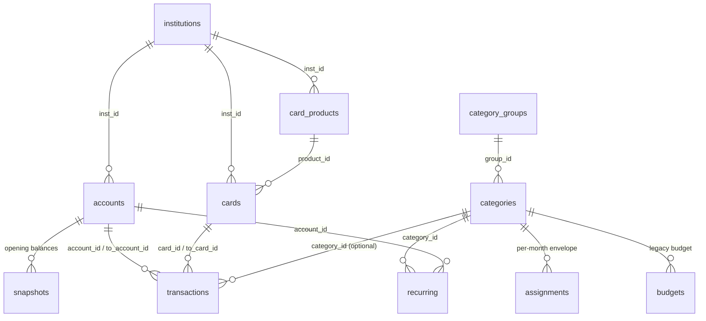

# API Documentation

## REST APIs

**None.** Raqam exposes no endpoints of its own and has no server code. All network I/O is `@supabase/supabase-js` from the browser: Supabase Auth (sessions) and PostgREST (table reads/writes), authorized entirely by Postgres RLS. The anon key ships in the bundle by design.

### Supabase table usage (from `src/store/sync.js` COLLECTIONS)

Every fetch is an **unfiltered** `select('*')` — the client sends no `user_id` anywhere (columns default to `auth.uid()` server-side) and trusts RLS to scope rows. Writes are `upsert` (default `onConflict: 'user_id,id'`) and `delete`, in FK-safe order (deletes reversed).

| Collection (client) | Table | Fetch | Writes | Identity / conflict key | Notes |
|---|---|---|---|---|---|
| `institutions` | `institutions` | all visible (global + own) | upsert/delete of rows with `own: true` only | `id` (plain PK — shared catalogue) | `own` flag derived from `user_id`, never sent |
| `cardProducts` | `card_products` | yes | **none** (fetch-only catalogue) | — | RLS has no write policies |
| `categoryGroups` | `category_groups` | yes | upsert/delete | `user_id,id` | |
| `categories` | `categories` | yes | upsert/delete | `user_id,id` | explicit nulls so clears propagate |
| `assignments` | `assignments` | yes | upsert/delete | **`user_id,category_id,month`**; deletes match `(category_id, month)` | differ keyed on `category|month`, not surrogate id (avoids 23505 loop) |
| `accounts` | `accounts` | yes | upsert/delete | `user_id,id` | |
| `cards` | `cards` | yes | upsert/delete | `user_id,id` | |
| `snapshots` | `snapshots` | yes | upsert/delete | `user_id,account_id,month`; deletes match `(account_id, month)` | `addIgnoreDuplicates: true` — a second device's rollover must not clobber a confirmed row |
| `transactions` | `transactions` | yes | upsert/delete | `user_id,id` | explicit nulls (edits can clear fields) |
| `budgets` | `budgets` | yes | upsert/delete | `user_id,id` | legacy budgets module |
| `recurring` | `recurring` | yes | upsert/delete | `user_id,id` | `schedule` normalized both ways |
| `payees` | `payees` | yes | upsert/delete | `user_id,id` | client `autoCategoryId: 'rta'` sentinel split into `auto_category_rta` boolean |
| `audit` | `audit_log` | newest 300, ordered by `at` desc (`AUDIT_FETCH_LIMIT`) | **insert only** (append-only; failures non-fatal, logged and skipped) | `user_id,id` | no update/delete — RLS enforces append-only |

Auth calls: `supabase.auth` session handling in `src/auth/AuthProvider.jsx`; `supabase.auth.refreshSession()` on 401 in the sync queue.

## Internal APIs

### Sync engine — `src/store/sync.js`
- `fetchAll() -> Promise<store>` — hydrates every collection into the client store shape (camelCase); one 2 s retry on Supabase clock-skew ("issued at future"); transactions sorted newest-first.
- `diffStores(prev, next) -> [{collection, added, changed, deletes}]` — compares `toRow()` JSON per collection; append-only collections produce adds only.
- `createSyncQueue({initialBaseline, onStatus}) -> { update(store), isClean(), drain(timeoutMs), stop(), resume() }` — single-flight write-behind queue. Statuses: `synced | syncing | retrying | error | rejected[:<table>]` (rejected = terminal for that diff; backoff 1s/2s/5s/15s; 401 → token refresh; other 4xx / constraint violations → rejected).
- `rejectedStatus(e) -> 'rejected:<table>' | 'rejected'`; `COLLECTIONS`, `AUDIT_FETCH_LIMIT`, `CLOCK_SKEW_RETRY_MS` exported for contract tests.

### Store interface — `src/store/StoreProvider.jsx`
- `useStore() -> { data, applyData(fn), replaceData(data), prefs, setPrefs(patch), prefsSaved, syncStatus, drainSync(), undo(), redo(), canUndo, canRedo, undoLabel, redoLabel, undoDepth, undoSeq }`.
- `usePrefs()` — the flat prefs facade (user prefs + device `theme/masked/maskedPosition/decimals/appLock`).
- `reducer(state, act)` — exported for tests; actions `hydrate | hydrateError | retry | data | undo | redo | replaceData`; `act.system` (rollover) clears undo stacks.
- Mutations come from `src/store/actions.js` (~60 pure `(data, payload) -> newData` functions; see business-overview.md for the catalog).

### Money & formatting — `src/lib/calc.js` (key exports)
- Formatting: `fmtNum(n, decimals)`, `fmtPKR(n, masked, decimals)` (`'Rs 425,000'`, U+2212 minus), `fmtSigned`, `fmtPKRCompact` (Rs 1.2M), `fmtPct`, `maskDigits(formatted)` (digits → `•`), `monthLabel`, `shortDate`, `dayLabel`, `timeLabel`, `relTime`. Locale is hardcoded `en-PK`; currency prefix hardcoded `'Rs '`. All money is **integer PKR** (bigint in DB, Number in client).
- Balances: `accountDelta(t, accId, now)`, `cardDelta`, `openingOf(acc, snapshots, month)`, `accountBalance(acc, store, month, now)`, `cardOutstanding`, `lastActivity`, `availableCredit`, `hasOccurred(t, now)` (pending/future exclusion), `effectsOf(t)`.
- Aggregation: `monthMetrics`, `categorySpending`, `dailySpending`, `largestExpenses`, `unbudgetedSpend`, `recoverableSpending`, `catMonthTotal`, `monthBudgetSpending`, `budgetSpent/Rollover/effectiveBudget/budgetProjection/budgetState`, `txBudgetImpact(store, t, opts)`.
- Lookups/refs: `catById`, `listCats`, `normalizeName`, `duplicateCat`, `catRefs`, `accountRefs`, `accountDeletePolicy`, `cardRefs`, `instById`, `instRefs`, `INST_KINDS`, `kindLabel`, `isExcludedCat`, `findDuplicate`, `inMonth`, `prevMonth`, `daysInMonth`, `daysAgo`, `daysUntil`.

### Formatting hook — `src/lib/format.js`
- `useMoney() -> { money, moneyS, moneyPos, moneySPos, moneyRaw, masked, maskedPosition }` — every rendered amount goes through one of these; `moneyRaw` deliberately ignores the mask (tooltips). Re-exports `parseAmt`, `uid`.

### Envelope math — `src/lib/envelope.js`
- `envelopeFor(store, month, now) -> { rows, rta, ... }` — the single fold from the earliest data month to the viewed month producing per-category `{assigned, activity, available}` + RTA. Includes archived categories (display filtering is the screen's job); earliest confirmed snapshot per account seeds RTA; pre-snapshot transactions skipped; fold clamped to 600 months.
- `assignedFor(store, catId, month)` — last matching assignment wins (mirrors the fold).
- `categoryActivityRows(store, catId, month, now)` / `categoryActivityRowsFor(store, catIds, month, now)` — the transactions behind an ACTIVITY figure (same predicate as the fold).
- Companions: `rtaBreakdownLines(env, prevRta, month)` (`rtaBreakdown.js`), `leftToSpend(env)` (`leftToSpend.js`), targets math in `targets.js`, reports in `reports.js` (`spendingByCategory/Group`, `spendingStats`, `netWorthSeries`, `incomeExpenseSeries`, `ageOfMoney`, `monthlySeries`).

### Dates — `src/lib/dates.js`
- `nowIso()` (naive local `YYYY-MM-DDTHH:mm`), `todayStr()`, `currentMonth()`, `addMonths(ym, k)`, `addDays`, `parseTypedDate`, `monthsBetween`, `clampDay`, `filterDateChars`, `monthsFor(store, {lookahead})` (Plan's +3 month lookahead).

## Data Models

**Current effective schema** after migrations `0001`–`0016` (all read). Global contracts from `0001`:
- money = `bigint` integer PKR (never floats); months = text `'YYYY-MM'`; datetimes = text `'YYYY-MM-DDTHH:mm'` **naive local wall-clock** (Asia/Karachi assumed — deliberately not timestamptz); ids = text; per-user tables use composite **PK `(user_id, id)`** with `user_id uuid default auth.uid()` cascading on user deletion; `created_at timestamptz` is server audit metadata.
- **RLS**: every table default-deny with RLS enabled; per-user tables carry four identical policies (select/insert/update/delete) `to authenticated` testing `(select auth.uid()) = user_id` (0011's envelope tables re-aligned to this exact form by 0015). **There is no plan/budget-book/tenant entity — `user_id` is the only scoping column anywhere.** No settings/preferences table exists (prefs live in localStorage).

### institutions (shared catalogue + user rows)
- **Fields**: `id text PK`, `user_id uuid NULL` (default `auth.uid()` since 0003; NULL = global curated row), `name text`, `kind text` in (Conventional, Islamic, Foreign, Microfinance, Digital, Custom), `created_at`. CHECK (0007): `user_id is not null or kind <> 'Custom'` — own rows may take any kind.
- **Relationships**: referenced by `accounts.inst_id`, `cards.inst_id`, `card_products.inst_id` (plain `id`, not composite).
- **RLS**: select global+own; insert own (any kind, 0007); update own (0007); delete own. Catalogue rows immutable from clients. Seeded with 11 Pakistani banks (0002).

### card_products (global catalogue)
- **Fields**: `id text PK`, `inst_id -> institutions`, `name`, `type` in (debit, credit, prepaid, virtual), `network`, `tier`.
- **RLS**: select-only for authenticated; **no write policies at all**. Seeded with 7 demo products (0002).

### categories
- **Fields**: `(user_id, id) PK`; `name`, `type` in (expense, income), `color` (default `#0F766E`), `created_at`; from 0004: `edited_at`, `edit_count`, `archived_at`, `icon` in (square, circle, diamond, ring, bar, triangle), `sort_order`, `is_system`, `status` in (active, archived), `description`; 0006: `exclude_from_budget bool`; 0011: `group_id -> category_groups (user_id, group_id), on delete set null`; 0013: `target_amount bigint NULL`, `target_mode` in (setaside, refill), `target_due_day smallint 1–28`, CHECK target_mode present iff target_amount is.
- **Constraints**: unique index on `(user_id, type, lower(btrim(regexp_replace(name,'\s+',' ','g'))))` — case/whitespace-insensitive name uniqueness per type (mirrors client `normalizeName`). 17 canonical seed categories share fixed ids (`groceries`, `salary`, …) across all users (client-seeded on first login; 0004 backfilled `is_system`).
- **Relationships**: referenced by transactions, budgets, recurring, assignments.

### category_groups (0011)
- **Fields**: `(user_id, id) PK`; `name`, `sort_order` (default 99), `created_at`.
- **Relationships**: parent of `categories.group_id` (set-null on delete).

### accounts
- **Fields**: `(user_id, id) PK`; `inst_id -> institutions`, `nickname`, `type` in (Current, Savings, Salary, Foreign currency, Mobile wallet), `currency` (default 'PKR'), `last4` ('' or 4 digits), `status` in (active, archived, closed — widened 0004), `notes`, `opened_on` date-text (the app's createdAt), `created_at`; 0004: `edited_at`, `edit_count`, `archived_at`. `islamic` column **dropped** (0008 — an account takes its bank's kind).
- **Relationships**: referenced (composite `(user_id, *)` FKs) by snapshots, transactions (`account_id`, `to_account_id`), cards (`linked_account_id`), recurring.

### snapshots (monthly opening balances)
- **Fields**: **PK `(user_id, account_id, month)`** — no surrogate id; `amount bigint`, `status` in (pending, confirmed), `confirmed_at` datetime-text, `corrected bool`, `history jsonb` (`[{amount, confirmedAt}]` correction provenance), `created_at`.
- **Relationships**: `(user_id, account_id) -> accounts on delete cascade`.

### cards
- **Fields**: `(user_id, id) PK`; `inst_id`, `product_id -> card_products NULL`, `nickname`, `type` in (debit, credit, prepaid, virtual), `network`, `tier`, `last4`, `linked_account_id -> accounts (set null)`, `credit_limit bigint NULL`, `opening_outstanding jsonb` (`{"YYYY-MM": int}` per-month credit opening liability), `statement_day 1–31`, `due_date`, `annual_fee_month`, `status` in (active, closed — narrowed 0004), `theme` (default teal), `created_at`; 0004: `edited_at`, `edit_count`, `closed_at`.

### transactions
- **Fields**: `(user_id, id) PK`; `date` datetime-text (minute precision), `type` in (expense, income, transfer, refund, adjustment, cardAdjustment — widened 0004), `amount bigint` (CHECK: signed only for adjustment/cardAdjustment; all else >= 0), `account_id`, `to_account_id`, `card_id`, `to_card_id` (all composite FKs, nullable), `is_card_payment bool`, `fee bigint >= 0 NULL` (transfer fees), `category_id -> categories NULL` (**optional category**), `merchant text` (the payee string — payee linkage is name-keyed), `notes`, `status` in (cleared, pending), `created_at`; 0004: `edited_at`, `edit_count`, `adjustment_reason`; 0014: `split_id text NULL` (client-minted group tag for split legs; no FK).
- **Validation**: date/month regex CHECKs; category optional by design (needs-category flow).

### budgets (legacy monthly budgets module)
- **Fields**: `(user_id, id) PK`; `category_id NULL -> categories cascade` (NULL = overall monthly budget), `amount bigint >= 0`, `label`, `created_at`; 0005: `rollover bool`, `edited_at`, `edit_count`.
- **Constraints**: `unique nulls not distinct (user_id, category_id)` — one budget per category plus one overall.

### assignments (envelope, 0011)
- **Fields**: `(user_id, id) PK` (surrogate); `category_id -> categories cascade`, `month 'YYYY-MM'`, `amount bigint` (default 0), `created_at`.
- **Constraints**: `unique (user_id, category_id, month)` — the real identity; the sync differ keys on it.

### recurring
- **Fields**: `(user_id, id) PK`; `name`, `type` in (expense, income), `amount bigint`, `estimated bool`, `next_date` date-text NULL, `account_id` / `card_id` / `category_id` (composite FKs, nullable), `status` (default active), `created_at`; 0009: `schedule jsonb` (`{every, unit, days[], ends}`), `occurrences jsonb` (`[{due, outcome, amount, txId, at}]` — deliberately not a child table), `auto_post bool`, `edited_at`, `edit_count`. Dropped by 0009: `freq`, `behaviour`, `done_this_month`.
- **Validation**: occurrence `txId` has no server FK — resolved client-side.

### payees (overlay, 0016)
- **Fields**: `(user_id, id) PK`; `name` (matched case-insensitively against `transactions.merchant`), `transfer_ref NULL` (customizes a synthesized transfer payee), `auto_categorize bool`, `auto_category_id text NULL` (**deliberately no FK** — integrity owned by the client sweep on category delete), `auto_category_rta bool` (client sentinel `'rta'`), `rename_rules jsonb []`, `hidden bool`, `created_at`.
- **Relationships**: name-keyed to transactions; a row exists only while a payee has customizations.

### audit_log (append-only, 0004 + widenings)
- **Fields**: `(user_id, id) PK`; `entity_type` in (transaction, account, card, category, budget, recurring, app, assignment, categoryGroup, payee), `entity_id`, `action` in (create, update, delete, archive, restore, adjust-balance, adjust-outstanding, reassign-delete, skip, undo, redo, move), `summary`, `before jsonb`, `after jsonb`, `at` datetime-text, `created_at`. Index on `(user_id, entity_type, entity_id, created_at)`.
- **Relationships**: **no FKs by design** — audit must survive entity deletion.
- **RLS**: insert + select own **only** — default-deny makes it append-only for clients. Client fetches newest 300.

### Entity relationship summary

**Text alternative**: institutions parent accounts, cards and card_products; card_products parent cards; accounts have snapshots and are referenced by transactions (from/to) and recurring; cards are referenced by transactions (from/to); categories are optionally referenced by transactions and are parents of assignments, budgets and recurring; category_groups group categories. payees and audit_log stand alone (name-keyed / deliberately FK-free). Every per-user row also belongs to `auth.users` via `user_id`.
