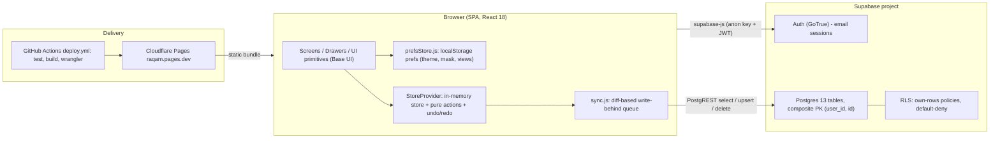
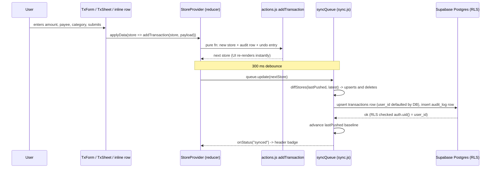

# System Architecture

## System Overview

Raqam is a **client-heavy single-page application** with no application server of its own. All business logic — envelope math, balances, reports, validation, even the audit trail — runs in the browser over one in-memory store. Supabase provides the only backend services: **Auth** (email/password sessions; signups currently disabled) and **Postgres** reached through PostgREST via `@supabase/supabase-js`, with **Row Level Security as the entire authorization layer** (the client queries with no filters and trusts RLS to scope rows to `auth.uid()`). The static bundle is built by Vite and served from **Cloudflare Pages** (`raqam.pages.dev`), auto-deployed by GitHub Actions on every push to `main`. It is an installable PWA (manifest + icons) with **deliberately no service worker** — online-only by design.

## Architecture Diagram

**Text alternative**: The browser runs the React SPA (UI layer → StoreProvider → sync.js queue; device/user prefs in localStorage). supabase-js talks to Supabase Auth for sessions and to Postgres via PostgREST for data; RLS own-rows policies are the only authorization. GitHub Actions tests, builds and deploys the static bundle to Cloudflare Pages, which serves it to browsers.

## Component Descriptions

### App shell & providers — `src/App.jsx`, `src/main.jsx`
- **Purpose**: Provider stack and routing (HashRouter).
- **Responsibilities**: `PrefsProvider → AuthProvider → (AuthScreen | StoreProvider → AppLockGate → MonthProvider → TxViewProvider → UIProvider → DrawerProvider → Shell)`. Routes: `/transactions[/:accountId]`, `/accounts`, `/budget` (Plan + `recurring` child), `/reflect` (6 report tabs, index = Overview/Dashboard), `/recurring/:id`, `/settings` (placeholder), `/dev-tools`; legacy paths (`/dashboard`, `/budgets`, `/categories`, `/reports`) redirect.
- **Dependencies**: react-router-dom, all providers.
- **Type**: Application.

### Auth — `src/auth/AuthProvider.jsx`, `AuthScreen.jsx`, `src/lib/supabase.js`
- **Purpose**: Session lifecycle over Supabase Auth.
- **Responsibilities**: session state, sign-in/out, `registerBeforeSignOut` hook so the store can drain pending writes first. `supabase.js` builds the single client from `VITE_SUPABASE_URL` / `VITE_SUPABASE_ANON_KEY` (baked at build time) and exports `supabaseConfigured`.
- **Type**: Application.

### Store — `src/store/StoreProvider.jsx`, `actions.js`, `audit.js`, `seed.js`, `undo.js`
- **Purpose**: Single in-memory data store with pure-function mutations.
- **Responsibilities**: hydrate once per login via `fetchAll()` (first login seeds the 17 canonical categories client-side); reducer applies `applyData(fn)` actions, records undo/redo stacks, appends audit rows; system actions (month rollover) clear undo stacks; debounced (300 ms) mirror of every change into the sync queue; `beforeunload` guard while the queue is dirty; drain on sign-out.
- **Type**: Application (state).

### Sync engine — `src/store/sync.js`
- **Purpose**: Optimistic, write-behind mirroring of the store to Supabase.
- **Responsibilities**: `COLLECTIONS` — 13 collection descriptors with camelCase↔snake_case mappers; `fetchAll` (unfiltered `select('*')` per table, trusts RLS; one clock-skew retry; audit capped to newest 300); `diffStores` (compares `toRow()` JSON against a `lastPushed` baseline); `pushDiff` (upserts in FK order, deletes in reverse; composite-key deletes for snapshots/assignments; append-only audit failures are non-fatal); `createSyncQueue` (single-flight, backoff 1s→15s, 401 refresh, non-retryable 4xx surfaces as `rejected:<table>`, `drain()` for sign-out/import).
- **Type**: Application (data access layer).

### Domain library — `src/lib/`
- **Purpose**: Pure business math and helpers (no React except hooks explicitly named `use*`).
- **Responsibilities**: `calc.js` (balances, deltas, budget math, PKR formatting), `envelope.js` (the envelope fold), `rtaBreakdown.js`, `leftToSpend.js`, `targets.js`, `reports.js` / `spendingReport.js`, `schedule.js`, `payees.js`, `undo.js`, `dates.js`, plus screen-logic modules (see code-structure.md).
- **Type**: Shared/Models.

### UI layer — `src/screens/`, `src/components/`, `src/drawers/`, `src/ui/`
- **Purpose**: Presentation. Desktop-first with phone render paths (`src/ui/*/phone/`) switched by `useIsPhone()` viewport query.
- **Responsibilities**: screens compose lib + store; drawers are a registry of forms; `src/ui/primitives/` wraps Base UI (Menu, Popover, Select, Combobox, Modal, BottomSheet, ScrollArea) — the mandated base for all new interactive primitives; plain-CSS theming via custom-property tokens in `src/styles/theme.css`.
- **Type**: Application.

### Database — `supabase/migrations/0001..0016`
- **Purpose**: Schema + RLS (see api-documentation.md for full data models).
- **Responsibilities**: 13 tables, every per-user table keyed `(user_id, id)` with `user_id default auth.uid()`; text dates/months (naive local wall-clock); bigint integer-PKR money; append-only `audit_log`.
- **Type**: Infrastructure (managed Postgres).

### Delivery — `.github/workflows/deploy.yml`, `scripts/`
- **Purpose**: CI/CD and ops scripts.
- **Responsibilities**: on push to `main` (or manual dispatch): pnpm install → `pnpm test` (vitest) → `pnpm build` → `wrangler pages deploy dist --project-name=raqam`. `scripts/backup-db.sh`, `raqam-dump.sh` (DB dumps), `ynab-load.mjs` (YNAB capture load). No preview deploys.
- **Type**: Infrastructure.

## Data Flow

Add-transaction flow (representative of every mutation):

**Text alternative**: The form calls `applyData` with a pure action; the reducer produces the next store (with audit + undo bookkeeping) and the UI updates optimistically. After a 300 ms debounce the sync queue diffs the store against the last successfully pushed baseline and pushes upserts (FK order) then deletes (reverse order) via PostgREST. Only full success advances the baseline; failures back off and retry (or surface as `rejected:<table>` when non-retryable). Hydration is the reverse: at login `fetchAll()` selects every table unfiltered, RLS returns only the user's rows, transactions sort newest-first, `rolloverMonth` runs, and the result becomes both store and baseline.

## Integration Points

- **External APIs**: none beyond Supabase. No bank feeds, no payment APIs.
- **Databases**: Supabase Postgres (single project; anon key in bundle; RLS-guarded). PostgREST is the wire protocol via supabase-js.
- **Third-party Services**:
  - Supabase Auth (email/password; signups disabled at project level).
  - Cloudflare Pages (static hosting, `raqam.pages.dev`).
  - GitHub Actions (CI/CD).
- **Browser platform**: localStorage (prefs, sidebar width, legacy `raqam.v1` data), WebAuthn (app lock), PWA manifest.

## Infrastructure Components

- **CDK Stacks**: none — no IaC at all. Supabase schema is managed via SQL files in `supabase/migrations/`; Cloudflare/GitHub configuration is manual + `deploy.yml`.
- **Deployment Model**: static direct-upload to Cloudflare Pages from GitHub Actions (`cloudflare/wrangler-action@v3`); production only from `main`; secrets `CLOUDFLARE_API_TOKEN`, `VITE_SUPABASE_URL`, `VITE_SUPABASE_ANON_KEY`. Vite splits `react`, `supabase`, and `base-ui` vendor chunks for stable caching; `base: './'` so the bundle is host-agnostic.
- **Networking**: none owned. HTTPS to Cloudflare's edge and to the Supabase project URL. `public/_headers` carries Pages response headers.
