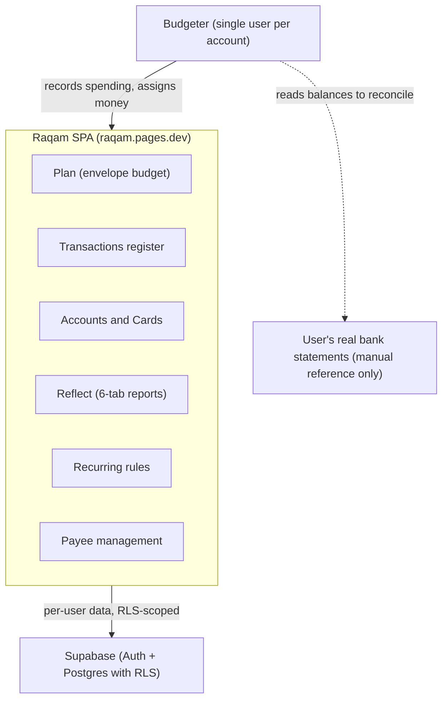

# Business Overview

## Business Context Diagram

**Text alternative**: A single budgeter uses the Raqam SPA (Plan, Transactions, Accounts/Cards, Reflect reports, Recurring, Payees). The SPA persists every financial record to Supabase (Auth + Postgres protected by Row Level Security). There is no bank integration — the user manually reconciles against real bank statements.

## Business Description

- **Business Description**: Raqam is a YNAB-style **zero-based envelope budgeting** app for personal finance, designed for Pakistan (integer-PKR money, `Rs` prefix, `en-PK` formatting, a seeded catalogue of Pakistani banks). The user gives every rupee a job: income lands in **Ready to Assign (RTA)**, is assigned into per-category monthly envelopes, and spending draws each envelope down. All entry is manual (no bank feeds); accounts are reconciled against monthly opening-balance snapshots. The app is online-only — one in-memory store per session, hydrated from Supabase at login and mirrored back through an optimistic diff-sync engine.

- **Business Transactions** (implemented as pure functions in `src/store/actions.js`, applied optimistically and synced):
  - **Record a transaction** — 5 types: expense, income, transfer, refund, adjustment (plus cardAdjustment); optional category ("needs category" flow), fees on transfers, pending vs cleared status, split expenses (legs sharing a `split_id`).
  - **Edit / delete / duplicate transactions**, incl. bulk operations (bulk delete, bulk re-categorize, bulk status change).
  - **Post a pending (future-dated) transaction now**.
  - **Assign money to a category** for a month (`setAssigned`), including a calculator-style entry cell.
  - **Move money between envelopes** (`moveAssigned`) and cover overspending (Plan inspector / phone Money Sheets).
  - **Month rollover** (`rolloverMonth`) — system action creating the new month's pending opening snapshots; YNAB-faithful carryover of category available balances is *derived*, never stored.
  - **Reconcile an account** — confirm/correct monthly opening snapshots (`confirmSnapshots`), correct balance (`adjustBalance` writes an adjustment transaction), reconcile drawer.
  - **Manage accounts** — add, edit, archive/restore, close (with balance zero-out), delete permanently; manage custom bank institutions (add/rename/reclassify/delete).
  - **Manage cards** — add, edit, close; record card payment; correct card outstanding.
  - **Manage categories & groups** — create, rename, note, archive/restore, delete with reassignment, exclude from budget (recoverable spending), reorder, move between groups; group CRUD incl. delete-with-reassignment.
  - **Set / clear category targets** — monthly target amount with `refill` or `setaside` mode and optional due day.
  - **Recurring schedules** — create/edit rules with a real recurrence engine (`schedule` jsonb), pause/resume, skip an occurrence, auto-post or seed transactions from occurrences.
  - **Manage payees** — overlay records over transaction merchant strings: rename (with merge of rename rules), combine, hide, auto-categorize, delete with reassignment.
  - **Undo / redo** — in-memory stacks over the pure store, each undo/redo itself audited.
  - **View reports** — Reflect's six tabs: Overview (former Dashboard), Spending Breakdown (YNAB parity), Spending Trends, Net Worth, Income vs Expense, Age of Money; CSV exports.
  - **Legacy import** — one-shot migration of pre-Supabase `raqam.v1` localStorage data.
  - **Privacy** — digit-preserving amount masking ("Hide amounts") and a WebAuthn app lock (Face ID gate).

- **Business Dictionary**:
  - **RTA / Ready to Assign** — unassigned money: income + opening balances + cash adjustments minus everything assigned to envelopes (derived by `envelopeFor`; explained by `rtaBreakdown.js`).
  - **Envelope** — a category's monthly budget bucket. **Assigned** (money put in this month) + **carryover** (last month's positive available) + **Activity** (signed spending/refunds this month) = **Available**.
  - **Zero-based budgeting** — every rupee is assigned until RTA is zero.
  - **Assignment** — one `(category, month, amount)` row; identity is the composite, not the surrogate id.
  - **Opening snapshot** — an account's opening balance for a month; `pending` until the user confirms it (reconciliation); the earliest *confirmed* snapshot seeds RTA as a lump sum.
  - **Cleared / pending** — transaction status; pending (incl. future-dated) rows are excluded from balances until they occur/clear.
  - **Adjustment** — a signed correction transaction (balance or card outstanding) with a reason; feeds RTA.
  - **Needs category** — an expense saved without a category; surfaced via pill/banner/CTA until categorized (categories are optional at entry).
  - **Exclude from budget / recoverable spending** — a category flag: full cash impact, zero budget impact (advances paid on behalf of others).
  - **Target** — a category's monthly goal; `refill` (top up to amount) or `setaside` (assign amount each month), optional due day (1–28).
  - **Split** — one purchase entered as multiple category legs sharing a `split_id`.
  - **Payee (overlay)** — the payee list is *derived* from distinct transaction merchants ∪ overlay rows; an overlay row exists only when a payee has customizations (rename rules, auto-category, hidden).
  - **Recurring rule / occurrence** — schedule (`every/unit/days/ends`) computing due dates; each occurrence resolves to posted / skipped, logged in the rule's `occurrences` jsonb.
  - **Month rollover** — the system boundary at a month change: new pending snapshots, recurring resets; clears undo history.
  - **Age of Money** — average days between earning money and spending it (Reflect tab).
  - **Masked mode** — every digit rendered as `•` (count preserved) for shared-screen privacy.
  - **Audit trail** — append-only log of every mutating action (who-free: single user), fetched capped at the most recent 300 rows.

## Component Level Business Descriptions

### Plan (envelope budget) — `src/screens/Plan.jsx`, `src/ui/plan/`, `src/lib/envelope.js`
- **Purpose**: The budgeting heart — YNAB-style table of category groups × (Assigned, Activity, Available) per month, with RTA in the header.
- **Responsibilities**: assign/move money, calculator entry, targets, filter views (built-in + custom, stored in per-user localStorage prefs), inspector with Auto-Assign actions, drag-and-drop reordering, phone render path (list + keypad sheet + money sheets).

### Transactions register — `src/screens/Transactions.jsx`, `src/ui/tx/`
- **Purpose**: The ledger — every transaction, filterable by account, searchable, sortable, with running balance.
- **Responsibilities**: inline row editor (desktop), TxForm drawer, phone TxSheet keypad editor, bulk bar, splits, needs-category banner, scheduled/pending section, day grouping on phone.

### Accounts & Cards — `src/screens/Accounts.jsx`, `src/ui/accounts/phone/`, drawers
- **Purpose**: Where the money physically sits — bank accounts and payment cards against the Pakistani institutions catalogue.
- **Responsibilities**: balances from snapshots + transaction deltas, archive/close/delete policies, reconciliation, card outstanding & credit available, card payments.

### Reflect (reports) — `src/screens/reflect/`, `src/lib/reports.js`, `src/lib/spendingReport.js`
- **Purpose**: Understanding money over time — six tabs behind one filter bar (date range, accounts, categories).
- **Responsibilities**: Overview (position, budget states, recent activity, first-use setup), Spending Breakdown with donut + drill-down + 2-file CSV export, Trends, Net Worth, Income vs Expense, Age of Money.

### Recurring — `src/screens/Recurring.jsx`, `RecurringDetail.jsx`, `src/lib/schedule.js`
- **Purpose**: Bills and salaries that repeat.
- **Responsibilities**: rule CRUD, recurrence math, occurrence outcomes (post / skip), auto-post, upcoming feed into the register's scheduled section.

### Payees — `src/ui/payees/`, `src/lib/payees.js`
- **Purpose**: Cleaning and automating merchant names.
- **Responsibilities**: manage-payees modal (list, detail, bulk), rename/combine with rename rules, auto-categorize (incl. the `rta` sentinel), hide, scoped undo window.

### Store & Sync — `src/store/`
- **Purpose**: The single source of truth and its server mirror.
- **Responsibilities**: hydrate once per login, pure-action reducer with undo/redo stacks, audit rows, debounced diff-sync to Supabase, drain-before-sign-out, month-boundary rollover.

### Auth & Privacy — `src/auth/`, `src/lib/appLock.js`, `src/components/LockScreen.jsx`
- **Purpose**: Who may see the ledger.
- **Responsibilities**: Supabase email auth gate (signups currently disabled at the project level), WebAuthn app lock that relocks on backgrounding, amount masking.

### Drawers — `src/drawers/`
- **Purpose**: Every create/edit form as a right-hand drawer (desktop) or bottom sheet (phone).
- **Responsibilities**: registry-driven (`drawers/index.js`): transaction, account, card, pay-card, adjust, reconcile, snapshot review, category, budget, recurring, reassignment forms.
