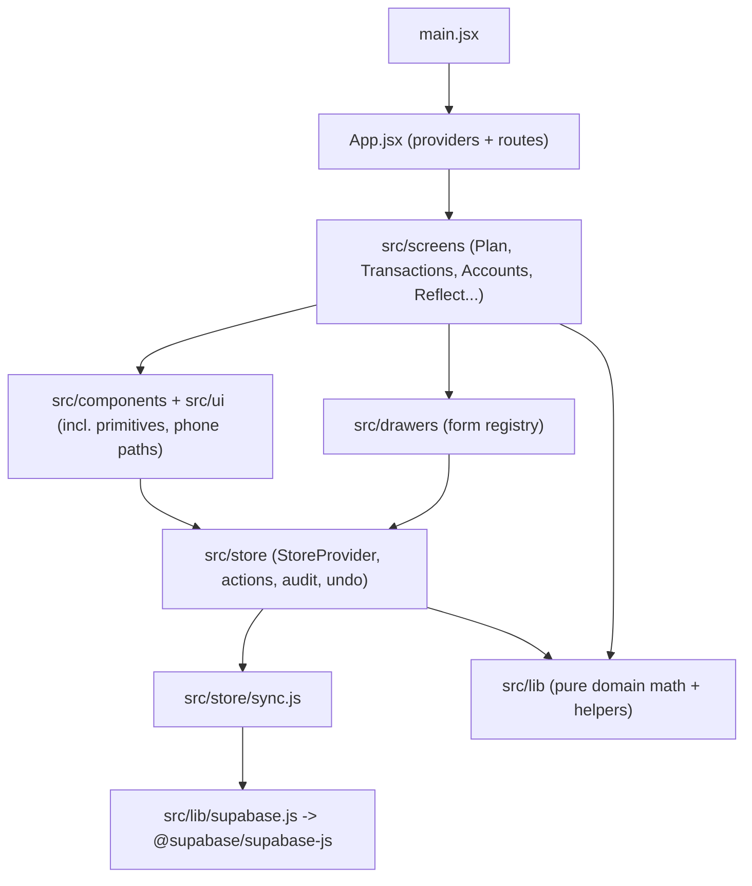

# Code Structure

## Build System

- **Type**: npm-ecosystem, **pnpm 10.33.4** (pinned via `packageManager`), single package `raqam@0.1.0` (ESM, `"type": "module"`).
- **Configuration**:
  - `package.json` — scripts: `dev`/`build`/`preview` (Vite), `test` (`vitest run`), `ynab:check`/`ynab:push` (YNAB capture loader).
  - `vite.config.js` — `@vitejs/plugin-react-swc`; `base: './'`; rolldown `advancedChunks` splitting `react`, `supabase`, `base-ui` vendor chunks.
  - `index.html` — PWA manifest + icons, **no service worker on purpose** (online-only app).
  - `.github/workflows/deploy.yml` — test → build → Cloudflare Pages deploy on push to `main`.
  - No tsconfig (plain JS/JSX), no ESLint/Prettier config files.

## Key Modules (hierarchy)

**Text alternative**: `main.jsx` mounts `App.jsx` (providers + HashRouter routes) → screens → components/ui/drawers → store (reducer + pure actions) → sync engine → Supabase client; screens and the store both lean on the pure `src/lib` domain layer.

## Existing Files Inventory

All files under `src/` (modification candidates). One line each; `*.test.js` files are colocated unit tests.

### Root / shell
- `src/main.jsx` - React 18 entry: StrictMode `createRoot` render of App, imports theme.css.
- `src/App.jsx` - Provider stack, HashRouter routes, resizable sidebar shell, AppLockGate, phone chrome (tab bar + AddTx pill).
- `src/styles/theme.css` - The whole design system: CSS custom-property tokens, light/dark themes, component classes.
- `src/assets/fonts/figtree-var.woff2` - Bundled Figtree variable font.

### Auth
- `src/auth/AuthProvider.jsx` - Session state + auth methods; mounted above StoreProvider; registerBeforeSignOut hook.
- `src/auth/AuthScreen.jsx` - Login/registration gate rendered when there is no session.

### Store (state + persistence)
- `src/store/StoreProvider.jsx` - Server-backed store: hydrate once per login, reducer (data/undo/redo/replace), debounced sync mirroring, prefs facade.
- `src/store/actions.js` - Every pure data-store action (~60 exports): transactions, accounts, cards, envelope, categories/groups, recurring, budgets, payees.
- `src/store/sync.js` - Supabase sync engine: COLLECTIONS mappers, fetchAll, diffStores, pushDiff, createSyncQueue (write-behind, backoff, rejected states).
- `src/store/audit.js` - Audit-trail helpers; every mutating action appends rows to `data.audit`.
- `src/store/seed.js` - Static catalogues + the empty starting store (17 canonical categories mirrored in migration 0004).
- `src/store/persistence.js` - Legacy localStorage layer (`raqam.v1`), now only read by the one-shot import.
- `src/store/MonthContext.jsx` - Selected reporting month shared by header selector and screens.
- `src/store/TxViewContext.jsx` - Transactions screen view state: date range, filters, sort, grouping.
- `src/store/PrefsProvider.jsx` - Device-level prefs (theme, masking, decimals, appLock) in localStorage.
- `src/store/archiveCategory.test.js` - Test: archiving a category returns its available money to RTA.

### Domain library (`src/lib`)
- `src/lib/calc.js` - Financial correctness core: integer-PKR formatting (`fmtPKR`, en-PK, masking), balances/deltas, budget math, ref-counting helpers.
- `src/lib/envelope.js` - Envelope fold: assigned/activity/available per category-month with YNAB-faithful carryover and RTA.
- `src/lib/rtaBreakdown.js` - Pure derivation of the "Ready to Assign" breakdown rows.
- `src/lib/leftToSpend.js` - "Left to spend" figure for the mobile dashboard.
- `src/lib/targets.js` - Monthly category-target math (refill / setaside, due day).
- `src/lib/reports.js` - Pure data helpers for Reflect: spending by category/group, stats, net worth / income-expense series, age of money.
- `src/lib/spendingReport.js` - Spending Breakdown report engine (range-aware sibling of reports.js).
- `src/lib/spendingExport.js` - Spending Breakdown's two-file CSV export mirroring YNAB's shapes.
- `src/lib/csv.js` - Tiny CSV export utility shared by the report tabs.
- `src/lib/dates.js` - Real-date layer: nowIso/todayStr/currentMonth, month arithmetic, typed-date parsing, months lookahead.
- `src/lib/dateRange.js` - Month-range presets shared by Transactions filter and Reflect reports.
- `src/lib/calendar.js` - Month-grid math for date pickers.
- `src/lib/schedule.js` - Recurrence engine for recurring rules (pure date math; `normalizeSchedule`).
- `src/lib/format.js` - `useMoney()` hook binding fmtPKR/fmtSigned to the privacy mask + decimals pref.
- `src/lib/util.js` - Dependency-free helpers: `parseAmt`, `uid`.
- `src/lib/validate.js` - Shared validation schemas for drawer forms.
- `src/lib/supabase.js` - The single Supabase client from `VITE_SUPABASE_*` env; `supabaseConfigured` flag.
- `src/lib/prefsStore.js` - Injectable localStorage JSON persistence (device + per-user prefs); write-failure boolean.
- `src/lib/undo.js` - Undo/redo stacks for the store (recordChange, applyUndo/applyRedo, labels).
- `src/lib/scopedUndo.js` - Manage-Payees modal's undo window over the global stack.
- `src/lib/moves.js` - Recent Moves: turning audit rows into readable day-grouped entries.
- `src/lib/payees.js` - Payee overlay derivation: distinct merchants ∪ overlay rows, transfer payees, matching.
- `src/lib/payeeOptions.js` - Sections for the inline editor's payee combobox.
- `src/lib/txRow.js` - Transaction-row and account-freshness presenters; first-use/setup state.
- `src/lib/txSearch.js` - Free-text search over a transaction.
- `src/lib/sortRows.js` - Sorting for the transactions table.
- `src/lib/registerColumns.js` - Register column visibility (pure, breakpoint-driven; opt-in BALANCE column).
- `src/lib/rowCursor.js` - Cursor math for keyboard row navigation.
- `src/lib/dayGroups.js` - Day sections for the phone Spending list.
- `src/lib/txEditorState.js` - The inline transaction editor's pure state machine (YNAB-vocabulary cells).
- `src/lib/splitTx.js` - Pure math + validation for split-expense entry.
- `src/lib/amountInput.js` - Live thousands separators for amount entry.
- `src/lib/calcExpr.js` - Left-to-right infix calculator for the ASSIGNED editor.
- `src/lib/keypadState.js` - Pure draft-string editing for the phone keypad (calculator expressions).
- `src/lib/needsCategoryBanner.js` - Desktop needs-category banner visibility logic.
- `src/lib/categoryOrder.js` - Plan screen's canonical category ordering.
- `src/lib/categoryPicker.js` - Active categories grouped/ordered/filtered for pickers.
- `src/lib/catIcon.js` - Category icon shape swatches (CSS).
- `src/lib/accountUsage.js` - Account/card usage frequency from transaction history.
- `src/lib/sidebarAccounts.js` - Live sidebar account rows (active accounts + balances).
- `src/lib/activityDrill.js` - Drill-down from Activity modal transaction into the register.
- `src/lib/inspector.js` - Pure math for the Plan inspector's Auto-Assign actions.
- `src/lib/planViews.js` - Plan filter views (built-in + custom, one shared shape).
- `src/lib/identity.js` - Friendly display name derived from the stored email.
- `src/lib/headerNav.js` - Which routes get the header month stepper.
- `src/lib/shortcuts.js` - Single source of truth for keyboard shortcuts.
- `src/lib/appLock.js` - WebAuthn biometric app-lock (privacy gate) logic.
- `src/lib/useAppLockToggle.js` - Shared enrollment-toggle hook for the app lock pref.
- `src/lib/useIsPhone.js` - Phone-shell viewport media-query hook.
- `src/lib/useContainerWidth.js` - ResizeObserver content-box width hook.
- `src/lib/ynabTree.js` - The user's captured YNAB category tree (for adoptYnabTree).
- Colocated tests: `appLock.test.js`, `calc.decimals.test.js`, `calc.mask.test.js`, `dayGroups.test.js`, `envelope.rta.test.js`, `needsCategoryBanner.test.js`, `registerColumns.test.js`, `rtaBreakdown.test.js`, `txRow.balance.test.js` - unit tests for the like-named modules.

### Screens
- `src/screens/Plan.jsx` - YNAB-style envelope budget table (groups, assign cells, filters, DnD, inspector).
- `src/screens/Transactions.jsx` - Transactions register: filters, search, sort, inline editor, bulk bar, scheduled section.
- `src/screens/Accounts.jsx` - Accounts list screen (desktop) with balances and freshness.
- `src/screens/BudgetHub.jsx` - Budget hub route shell hosting Plan and the Recurring child route.
- `src/screens/Recurring.jsx` - Recurring rules list.
- `src/screens/RecurringDetail.jsx` - One rule's detail: schedule, occurrence history, actions.
- `src/screens/Dashboard.jsx` - The Reflect "Overview" index tab (former standalone dashboard) + FirstUse gate.
- `src/screens/FirstUse.jsx` - First-use guided setup (add account, snapshot, first tx).
- `src/screens/DevTools.jsx` - Hand-maintained registry/showcase of the app's reusable UI pieces.
- `src/screens/Planned.jsx` - Placeholder screen for not-yet-built areas (Settings).
- `src/screens/Budgets.jsx` - **Orphaned** legacy Budgets screen (design iteration 002); no route imports it.
- `src/screens/Cards.jsx` - **Orphaned** card wallet screen; no route imports it.
- `src/screens/reflect/Reflect.jsx` - Reporting shell: six-tab strip + shared filter bar.
- `src/screens/reflect/SpendingBreakdown.jsx` - YNAB-parity spending report (donut, table, export).
- `src/screens/reflect/SpendingTrends.jsx` - Total spending per month over 12 months.
- `src/screens/reflect/NetWorth.jsx` - Net worth level over 12 months.
- `src/screens/reflect/IncomeVsExpense.jsx` - Grouped income/expense bars per month.
- `src/screens/reflect/AgeOfMoney.jsx` - Age-of-money trend tab.

### Components
- `src/components/Header.jsx` - App header: month stepper, sync/prefs badges, lock icon, header slot target.
- `src/components/Sidebar.jsx` - Desktop nav sidebar (Budget / Reflect / Spending glyphs + accounts section).
- `src/components/AccountList.jsx` - Sidebar ACCOUNTS section: live flat list of active accounts.
- `src/components/SidebarUser.jsx` - Pinned bottom identity row (name + email, menu trigger).
- `src/components/UserMenu.jsx` - Account menu opening upward from the identity row.
- `src/components/TxMonthNav.jsx` - Transactions date control in the header slot (Base UI migration pilot).
- `src/components/MonthGridPopover.jsx` - "Aug 2026" trigger + year-paged 4x3 month grid.
- `src/components/TxPhoneList.jsx` - Phone Spending register presentation (day groups, YNAB anatomy).
- `src/components/MobileTabBar.jsx` - Phone floating bottom tab bar (Reflect / Plan / Spending / Accounts).
- `src/components/AddTxPill.jsx` - Floating "+ Transaction" pill above the phone tab bar.
- `src/components/CategoryPickerPopover.jsx` - Desktop anchored category-picker popover.
- `src/components/CategoryPickerSheet.jsx` - Phone category picker bottom sheet.
- `src/components/GlobalShortcuts.jsx` - App-level keys (? help, U undo, L lock, etc.).
- `src/components/RecentMoves.jsx` - "What you changed" audit feed grouped by day.
- `src/components/PositionStrip.jsx` - "Current position" headline numbers strip.
- `src/components/ImportLegacy.jsx` - One-shot pre-Supabase (`raqam.v1`) data migration offer.
- `src/components/LoadingScreen.jsx` - Themed splash for auth check + hydration (with retry on error).
- `src/components/LockScreen.jsx` - Full-screen biometric lock overlay.

### Drawers (form registry)
- `src/drawers/index.js` - Drawer registry: name → { title, sub, cta, Body, useSubmit }.
- `src/drawers/openers.js` - Drawer-opening prefill helpers.
- `src/drawers/fields.jsx` - Shared form primitives for drawer bodies.
- `src/drawers/TxForm.jsx` - Add/edit transaction drawer (5 types, per-type field groups).
- `src/drawers/AccountForm.jsx` - Add/edit account drawer.
- `src/drawers/BankKindField.jsx` - Inline editor for the user's own bank institutions.
- `src/drawers/CardForm.jsx` - Add/edit card drawer.
- `src/drawers/PayCardForm.jsx` - Record card payment drawer.
- `src/drawers/AdjustForm.jsx` - Correct account balance drawer (target-value entry).
- `src/drawers/AdjustCardForm.jsx` - Correct card outstanding drawer.
- `src/drawers/ReconcileForm.jsx` - Reconcile drawer: confirm one account's balance.
- `src/drawers/SnapshotForm.jsx` - Monthly opening snapshot review drawer.
- `src/drawers/CategoryForm.jsx` - Category create/edit drawer.
- `src/drawers/ReassignForm.jsx` - Delete-category-with-reassignment drawer.
- `src/drawers/ReassignGroupForm.jsx` - Delete-group-with-reassignment drawer.
- `src/drawers/BudgetForm.jsx` - Budget drawer (legacy budgets module).
- `src/drawers/RecurringForm.jsx` - Recurring rule drawer.
- `src/drawers/WhenField.jsx` - "When" date field (typed + calendar).
- `src/drawers/useCloseAccount.jsx` - Confirm-dialog body/flow for closing an account.

### UI (`src/ui`)
- `src/ui/UIProvider.jsx` - Toasts + confirm dialog context.
- `src/ui/DrawerProvider.jsx` - Drawer chrome/state; picks drawer vs phone sheet shell.
- `src/ui/HeaderSlot.jsx` - Portal target letting a screen fill part of the Header.
- `src/ui/AppLockContext.jsx` - Bridges the manual "Lock now" icon to AppLockGate.
- `src/ui/FocusTrap.jsx` - Tab-focus trap for dialogs, restores focus on close.
- `src/ui/Toast.jsx` - aria-live toast.
- `src/ui/ConfirmDialog.jsx` - Confirm dialog.
- `src/ui/ExplainDialog.jsx` - "How these numbers are calculated" dialog.
- `src/ui/ShortcutHelpModal.jsx` - Keyboard shortcut help modal (renders SHORTCUT_GROUPS).
- `src/ui/Kbd.jsx` - Keycap chip.
- `src/ui/Tooltip.jsx` - Dark tooltip with action label + keycaps.
- `src/ui/icons.jsx` - The app's only SVG icons.
- `src/ui/SortIcon.jsx` - Sort-state icon.
- `src/ui/SearchField.jsx` - Compact grow-on-focus search box (presentational).
- `src/ui/Checkbox.jsx` - Checkbox form primitive.
- `src/ui/BulkBar.jsx` - Floating bulk-action toolbar for selected rows.
- `src/ui/RowMenu.jsx` - Per-row overflow (kebab) menu.
- `src/ui/ToolbarAction.jsx` - Shared toolbar action button + icons.
- `src/ui/TxChips.jsx` - Transaction row badge cluster (transfer, repeats, edited, excluded).
- `src/ui/MaskPositionEye.jsx` - Privacy eye toggling `maskedPosition` only.
- `src/ui/PlanCategoryPicker.jsx` - One-field category combobox (field IS the search input).
- `src/ui/categoryActions.js` - Shared category delete/hide flows.
- `src/ui/useShortcuts.js` - One bubble-phase keydown listener hook.
- `src/ui/charts/Bars.jsx` - Dependency-free div-bar chart for report tabs.
- **Primitives (Base UI wrappers)** — `src/ui/primitives/`: `Menu.jsx`, `Popover.jsx`, `Select.jsx`, `Combobox.jsx`, `Modal.jsx` (desktop dialog), `BottomSheet.jsx` (phone dialog), `ScrollArea.jsx` — tokened wrappers over `@base-ui/react`; the mandated base for all new interactive primitives.
- **Plan UI** — `src/ui/plan/`: `Inspector.jsx` (selection sidebar), `ActivityPopover.jsx` (activity drill-down), `EditNamePopover.jsx`, `FilterPills.jsx`, `ManageViewsModal.jsx`, `ViewEditorModal.jsx`, `usePlanDnd.js` (drag payload logic); phone: `PlanPhone.jsx` (list render path), `KeypadSheet.jsx` (assign keypad), `MoneySheets.jsx` (cover/move flows), `PlanOverflowMenu.jsx`.
- **Accounts phone** — `src/ui/accounts/phone/`: `AccountsPhone.jsx` (grouped list), `accountsPhone.js` (pure derivations), `ArchivedSheet.jsx`.
- **Transactions inline editor** — `src/ui/tx/inline/`: `TxEditorRow.jsx` (row shell), `DateCell.jsx`, `PayeeCell.jsx`, `CategoryCell.jsx`, `AccountCell.jsx`, `AmountCell.jsx`, `SplitRows.jsx`.
- **Transactions phone** — `src/ui/tx/phone/`: `TxSheet.jsx` (phone-native addTx shell, five types), `txSheetState.js` (per-type presentation facts).
- **Phone shared** — `src/ui/phone/Keypad.jsx` - shared on-screen key grid (digits/ops/Done).
- **Payees** — `src/ui/payees/`: `ManagePayees.jsx` (two-pane modal), `PayeeDetail.jsx` (single-payee editor), `PayeeBulk.jsx` (combine/hide/delete-all), `PayeeTxList.jsx` (matching-transactions sub-modal).
- **Reflect UI** — `src/ui/reflect/`: `ReportFilterBar.jsx`, `FilterMultiSelect.jsx`, `SpendingDonut.jsx` (ECharts donut), `TransactionPopover.jsx`, `ExportModal.jsx`.

### Tests outside src
- `tests/*.test.js` — 80 vitest files covering actions, envelope math, sync contracts, reports, pickers, keyboard state machines, etc. (see code-quality-assessment.md).

## Design Patterns

### Pure-store + reducer pattern
- **Location**: `src/store/actions.js` + `StoreProvider.jsx`.
- **Purpose**: Every mutation is a pure `(data, payload) -> newData` function, making undo/redo, audit, and unit testing trivial (no jsdom needed).
- **Implementation**: `applyData(fn)` dispatches into a reducer; identical-reference return means no-op; system actions clear undo stacks.

### Diff-sync (write-behind mirror)
- **Location**: `src/store/sync.js`.
- **Purpose**: Keep UI optimistic and Supabase eventually consistent without per-action network code.
- **Implementation**: collection descriptors with `toRow/fromRow` mappers; JSON-compare of `toRow()` output vs a baseline; FK-ordered upserts, reverse-ordered deletes; single-flight queue with backoff and `rejected:<table>` terminal states.

### RLS-as-authorization
- **Location**: migrations + every query in `sync.js`.
- **Purpose**: Client never filters by user; the DB is the security boundary; `user_id` is defaulted server-side (`auth.uid()`), never sent by the client.
- **Implementation**: identical own-rows policies on every per-user table; composite PK `(user_id, id)`.

### Drawer registry
- **Location**: `src/drawers/index.js`, `src/ui/DrawerProvider.jsx`.
- **Purpose**: One drawer chrome, many forms; phone gets a bottom-sheet shell (TxSheet) for the same form state.
- **Implementation**: name → `{ title, sub, cta, Body, useSubmit }` map; `openers.js` prefill helpers.

### Base UI primitives layer
- **Location**: `src/ui/primitives/`.
- **Purpose**: Project rule — all new interactive primitives are tokened wrappers over `@base-ui/react`, never hand-rolled.
- **Implementation**: thin wrappers applying theme.css tokens over Base UI Menu/Popover/Select/Combobox/Dialog/ScrollArea.

### prefsStore localStorage pattern
- **Location**: `src/lib/prefsStore.js`, `PrefsProvider.jsx`, `StoreProvider.jsx`.
- **Purpose**: Settings (not money) persist per device / per user in localStorage; write failures surface as a quiet badge.
- **Implementation**: injectable `readJson`/`writeJson` returning success booleans; `raqam.prefs.u.<uid>` keys; facade merges device + user prefs.

### Desktop/phone split render paths
- **Location**: `src/ui/*/phone/`, `useIsPhone.js`.
- **Purpose**: YNAB-style phone anatomy without forking business logic.
- **Implementation**: screens branch on a viewport media query; phone paths reuse the same store/lib and often the same submit hooks.

## Critical Dependencies

### react / react-dom
- **Version**: ^18.3.1
- **Usage**: Whole UI; StrictMode double-render assumptions are baked into hydration and sync-queue code.
- **Purpose**: Component model.

### @supabase/supabase-js
- **Version**: ^2.111.0
- **Usage**: `src/lib/supabase.js` (client), `sync.js` (PostgREST queries), `AuthProvider` (sessions).
- **Purpose**: Auth + database wire protocol; the app's only backend SDK.

### @base-ui/react
- **Version**: ^1.7.0
- **Usage**: `src/ui/primitives/*` wrappers (Menu, Popover, Select, Combobox, Dialog, ScrollArea).
- **Purpose**: Accessible headless primitives (project-mandated).

### react-router-dom
- **Version**: ^6.30.0
- **Usage**: `App.jsx` HashRouter + nested routes; `useLocation`/`useNavigate` across screens.
- **Purpose**: Client-side routing.

### echarts
- **Version**: ^6.1.0
- **Usage**: `src/ui/reflect/SpendingDonut.jsx` (tree-shaken import).
- **Purpose**: The Spending Breakdown donut; all other charts are dependency-free divs.

### vite / @vitejs/plugin-react-swc / vitest
- **Version**: ^8.2.1 / ^3.11.0 / ^4.1.10
- **Usage**: Build, dev server, vendor chunking; `pnpm test` runs vitest (no jsdom — UI is verified via a Playwright harness outside the repo's test suite).
- **Purpose**: Toolchain.
