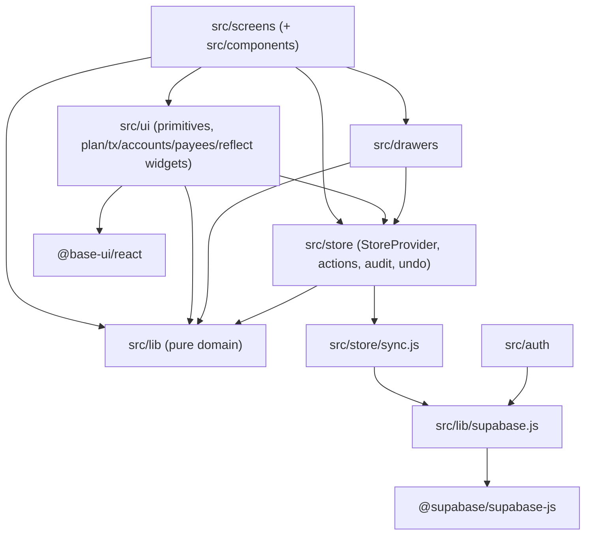

# Dependencies

## Internal Dependencies

Single package — "internal dependencies" are module-layer dependencies inside `src/`:

**Text alternative**: screens/components depend on ui widgets, drawers, the store and the pure lib; ui and drawers also read the store and lib; the store depends on lib (actions, undo, dates) and on sync.js; sync.js and auth depend on the single supabase client (`src/lib/supabase.js` → supabase-js); ui primitives depend on Base UI. The lib layer depends on nothing above it (pure, React-free except explicit hooks).

### Layer rules observed
- **screens → store → lib**: screens never call supabase-js directly; every mutation goes `applyData(pure action)` and reaches the server only via the sync queue's diff. — Type: runtime; Reason: optimistic UI + testability.
- **store/sync.js → lib/supabase.js**: the only data-plane network dependency in the app. — Type: runtime; Reason: single client, single sync path.
- **ui/primitives → @base-ui/react**: project convention — interactive primitives are tokened Base UI wrappers, and the rest of `src/ui` consumes those wrappers, not Base UI directly. — Type: runtime.
- **lib is leaf-level**: `src/lib` modules import only each other (e.g. `envelope.js → calc.js, dates.js`) so vitest runs them node-side without jsdom. — Type: compile/test; Reason: pure-function testing strategy.
- **tests → src**: `tests/*.test.js` import store actions, lib modules and sync contracts (e.g. `COLLECTIONS` mappers) directly. — Type: test.

## External Dependencies

Versions are the ranges declared in `package.json` (resolved via `pnpm-lock.yaml`).

### react / react-dom
- **Version**: ^18.3.1
- **Purpose**: UI component model, StrictMode-safe hydration.
- **License**: MIT

### react-router-dom
- **Version**: ^6.30.0
- **Purpose**: HashRouter routing, nested routes, redirects for legacy paths.
- **License**: MIT

### @base-ui/react
- **Version**: ^1.7.0
- **Purpose**: Headless accessible primitives (Menu, Popover, Select, Combobox, Dialog, ScrollArea) behind `src/ui/primitives/`; brings @floating-ui transitively (own vendor chunk).
- **License**: MIT

### @supabase/supabase-js
- **Version**: ^2.111.0
- **Purpose**: Auth sessions + PostgREST queries; the app's entire backend surface.
- **License**: MIT

### echarts
- **Version**: ^6.1.0
- **Purpose**: Spending Breakdown donut only (tree-shaken import in `SpendingDonut.jsx`).
- **License**: Apache-2.0

### vite (dev)
- **Version**: ^8.2.1
- **Purpose**: Build/dev server; rolldown-based vendor chunk splitting.
- **License**: MIT

### @vitejs/plugin-react-swc (dev)
- **Version**: ^3.11.0
- **Purpose**: SWC React transform (fast refresh, JSX).
- **License**: MIT

### vitest (dev)
- **Version**: ^4.1.10
- **Purpose**: Test runner for the 90 pure-function test files; gates deploys in CI.
- **License**: MIT

Notes: dependency surface is deliberately tiny (6 runtime deps). No lodash/date-fns (own `dates.js`), no CSS framework, no state library, no form library.
